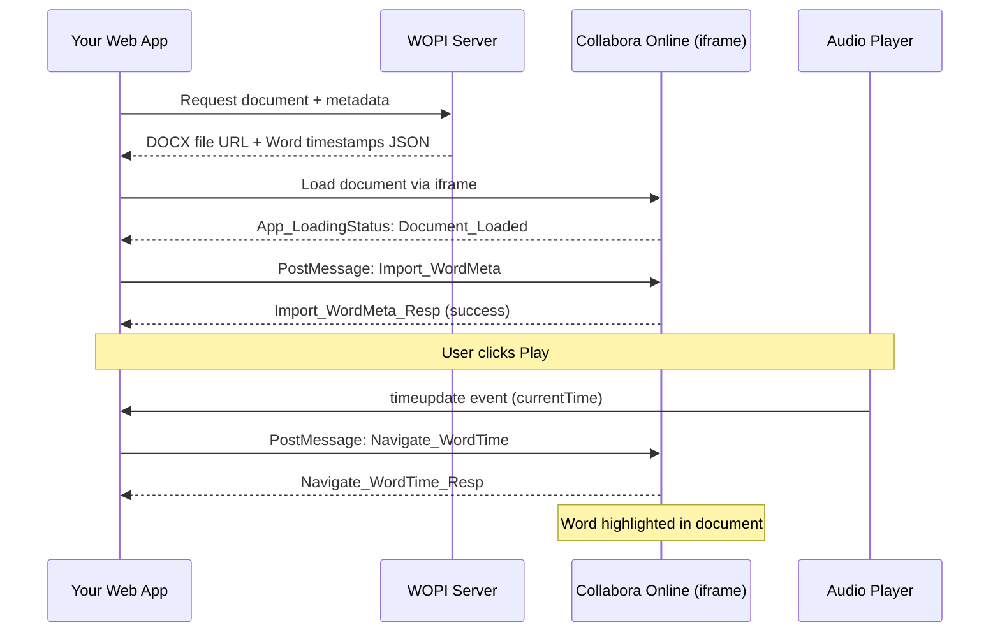
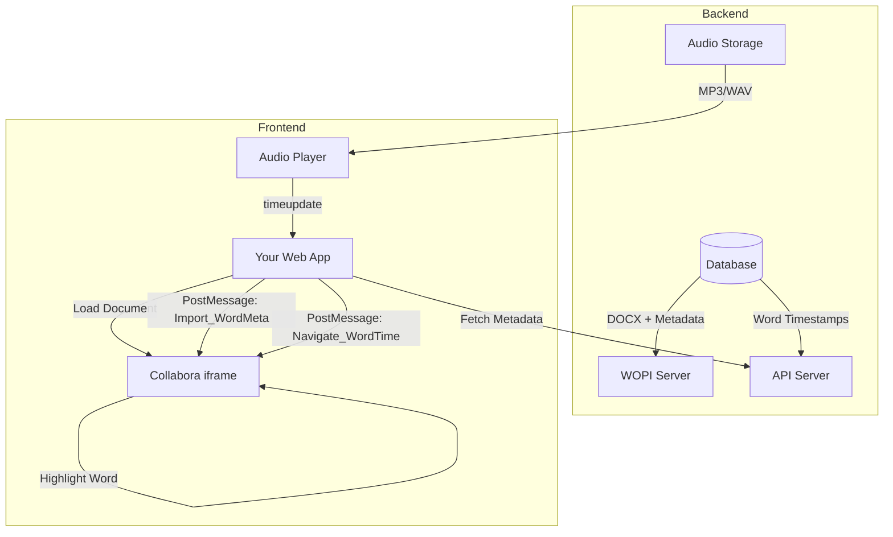

# Audio Playback Integration with Collabora Online WordMeta

This guide explains how to integrate word-level audio synchronization with your modified Collabora Online instance.

---

## Architecture Overview



---

## Step 1: Prepare Your Data

### Word Metadata JSON Format

Your backend should provide word timestamps in this format (e.g., from Deepgram, Whisper, or similar):

```json
{
  "words": [
    { "word": "Hello", "start": 0.0, "end": 0.52, "confidence": 0.98 },
    { "word": "world", "start": 0.55, "end": 1.02, "confidence": 0.95 },
    { "word": "this", "start": 1.10, "end": 1.35, "confidence": 0.97 },
    { "word": "is", "start": 1.38, "end": 1.52, "confidence": 0.99 },
    { "word": "a", "start": 1.55, "end": 1.62, "confidence": 0.96 },
    { "word": "test", "start": 1.65, "end": 2.10, "confidence": 0.94 }
  ],
  "audioUrl": "https://your-server.com/audio/recording.mp3"
}
```

> [!IMPORTANT]
> The order of words in this array must **exactly match** the order of words in the DOCX document. The system uses array indices for word identification.

---

## Step 2: Set Up the Collabora iframe

### HTML Structure

```html
<!DOCTYPE html>
<html>
<head>
    <title>Document with Audio Playback</title>
    <style>
        #collabora-frame {
            width: 100%;
            height: 70vh;
            border: none;
        }
        #audio-controls {
            padding: 20px;
            background: #f5f5f5;
            display: flex;
            align-items: center;
            gap: 15px;
        }
        #current-word {
            font-size: 18px;
            font-weight: bold;
            color: #333;
        }
    </style>
</head>
<body>
    <!-- Collabora iframe -->
    <iframe id="collabora-frame" 
            src="https://your-collabora-server:9980/browser/dist/cool.html?WOPISrc=YOUR_WOPI_URL"
            allow="clipboard-read; clipboard-write">
    </iframe>
    
    <!-- Audio Controls -->
    <div id="audio-controls">
        <button id="play-pause">▶️ Play</button>
        <input type="range" id="seek-bar" min="0" max="100" value="0">
        <span id="time-display">0:00 / 0:00</span>
        <span id="current-word">-</span>
    </div>
    
    <!-- Hidden Audio Element -->
    <audio id="audio-player" preload="auto"></audio>

    <script src="audio-sync.js"></script>
</body>
</html>
```

---

## Step 3: Integration JavaScript

### Full Implementation (`audio-sync.js`)

```javascript
/**
 * Audio-Word Synchronization for Collabora Online
 * Uses PostMessage API to communicate with WordMeta plugin
 */

class CollaboraAudioSync {
    constructor(options) {
        this.iframeId = options.iframeId || 'collabora-frame';
        this.audioId = options.audioId || 'audio-player';
        this.wopiOrigin = options.wopiOrigin; // e.g., 'https://your-collabora-server:9980'
        
        this.iframe = document.getElementById(this.iframeId);
        this.audio = document.getElementById(this.audioId);
        
        this.wordMetadata = [];
        this.isCollaboraReady = false;
        this.currentWordIndex = -1;
        
        this._setupEventListeners();
    }

    /**
     * Initialize with document data
     * @param {Object} data - { words: [...], audioUrl: '...' }
     */
    async initialize(data) {
        this.wordMetadata = data.words;
        this.audio.src = data.audioUrl;
        
        // Wait for Collabora to be ready
        await this._waitForCollaboraReady();
        
        // Import word metadata into Collabora
        const success = await this._importWordMeta(data.words);
        if (success) {
            console.log('✅ Word metadata imported successfully');
        } else {
            console.error('❌ Failed to import word metadata');
        }
    }

    // ==================== PostMessage Communication ====================

    _setupEventListeners() {
        // Listen for messages from Collabora
        window.addEventListener('message', (event) => {
            this._handleCollaboraMessage(event);
        });
        
        // Audio time update - sync with document
        this.audio.addEventListener('timeupdate', () => {
            this._syncToCurrentTime();
        });
        
        // UI controls
        document.getElementById('play-pause')?.addEventListener('click', () => {
            this.togglePlayPause();
        });
    }

    _handleCollaboraMessage(event) {
        // Verify origin for security
        if (this.wopiOrigin && !event.origin.includes(new URL(this.wopiOrigin).hostname)) {
            return;
        }

        let msg;
        try {
            msg = typeof event.data === 'string' ? JSON.parse(event.data) : event.data;
        } catch (e) {
            return;
        }

        switch (msg.MessageId) {
            case 'App_LoadingStatus':
                if (msg.Values?.Status === 'Document_Loaded') {
                    console.log('📄 Collabora document loaded');
                    this.isCollaboraReady = true;
                }
                break;
                
            case 'Import_WordMeta_Resp':
                console.log('📝 Import response:', msg.Values);
                break;
                
            case 'Navigate_WordTime_Resp':
                console.log('🔍 Navigate response:', msg.Values);
                break;
                
            case 'Get_WordMeta_Resp':
                console.log('📖 Word metadata:', msg.Values);
                break;
        }
    }

    _postToCollabora(messageId, values = {}) {
        if (!this.iframe?.contentWindow) {
            console.error('Collabora iframe not found');
            return;
        }
        
        const msg = {
            MessageId: messageId,
            Values: values
        };
        
        const origin = this.wopiOrigin || '*';
        this.iframe.contentWindow.postMessage(JSON.stringify(msg), origin);
    }

    _waitForCollaboraReady() {
        return new Promise((resolve) => {
            if (this.isCollaboraReady) {
                resolve();
                return;
            }
            
            const checkInterval = setInterval(() => {
                if (this.isCollaboraReady) {
                    clearInterval(checkInterval);
                    resolve();
                }
            }, 100);
            
            // Timeout after 30 seconds
            setTimeout(() => {
                clearInterval(checkInterval);
                resolve(); // Continue anyway
            }, 30000);
        });
    }

    // ==================== WordMeta API ====================

    /**
     * Import word metadata into Collabora
     */
    async _importWordMeta(words) {
        return new Promise((resolve) => {
            const handler = (event) => {
                let msg;
                try {
                    msg = typeof event.data === 'string' ? JSON.parse(event.data) : event.data;
                } catch (e) {
                    return;
                }
                
                if (msg.MessageId === 'Import_WordMeta_Resp') {
                    window.removeEventListener('message', handler);
                    resolve(msg.Values?.success);
                }
            };
            
            window.addEventListener('message', handler);
            
            this._postToCollabora('Import_WordMeta', { words });
            
            // Timeout
            setTimeout(() => {
                window.removeEventListener('message', handler);
                resolve(false);
            }, 5000);
        });
    }

    /**
     * Navigate to word at specific timestamp
     */
    navigateToTime(timeSeconds) {
        this._postToCollabora('Navigate_WordTime', { time: timeSeconds });
    }

    /**
     * Get metadata for a specific word
     */
    getWordMeta(index) {
        this._postToCollabora('Get_WordMeta', { index });
    }

    // ==================== Audio Sync ====================

    _syncToCurrentTime() {
        const currentTime = this.audio.currentTime;
        
        // Find the word at current timestamp using binary search
        const wordIndex = this._findWordAtTime(currentTime);
        
        // Only update if word changed
        if (wordIndex !== this.currentWordIndex && wordIndex >= 0) {
            this.currentWordIndex = wordIndex;
            
            // Tell Collabora to navigate to this word
            this.navigateToTime(currentTime);
            
            // Update UI
            const word = this.wordMetadata[wordIndex];
            if (word) {
                document.getElementById('current-word').textContent = `"${word.word}"`;
            }
        }
        
        // Update time display
        this._updateTimeDisplay();
    }

    _findWordAtTime(timeSeconds) {
        // Binary search for efficiency
        let left = 0;
        let right = this.wordMetadata.length - 1;
        let result = -1;

        while (left <= right) {
            const mid = Math.floor((left + right) / 2);
            const word = this.wordMetadata[mid];

            if (timeSeconds >= word.start && timeSeconds <= word.end) {
                return mid;
            } else if (timeSeconds < word.start) {
                right = mid - 1;
            } else {
                result = mid;
                left = mid + 1;
            }
        }

        return result;
    }

    _updateTimeDisplay() {
        const current = this._formatTime(this.audio.currentTime);
        const duration = this._formatTime(this.audio.duration || 0);
        document.getElementById('time-display').textContent = `${current} / ${duration}`;
        
        const seekBar = document.getElementById('seek-bar');
        if (seekBar && this.audio.duration) {
            seekBar.value = (this.audio.currentTime / this.audio.duration) * 100;
        }
    }

    _formatTime(seconds) {
        const mins = Math.floor(seconds / 60);
        const secs = Math.floor(seconds % 60);
        return `${mins}:${secs.toString().padStart(2, '0')}`;
    }

    // ==================== Playback Controls ====================

    togglePlayPause() {
        if (this.audio.paused) {
            this.audio.play();
            document.getElementById('play-pause').textContent = '⏸️ Pause';
        } else {
            this.audio.pause();
            document.getElementById('play-pause').textContent = '▶️ Play';
        }
    }

    play() {
        this.audio.play();
    }

    pause() {
        this.audio.pause();
    }

    seekTo(timeSeconds) {
        this.audio.currentTime = timeSeconds;
        this.navigateToTime(timeSeconds);
    }

    /**
     * Jump to a specific word by clicking in document
     * (For future: Collabora could send click events)
     */
    jumpToWord(wordIndex) {
        if (wordIndex >= 0 && wordIndex < this.wordMetadata.length) {
            const word = this.wordMetadata[wordIndex];
            this.audio.currentTime = word.start;
            this.audio.play();
        }
    }
}

// ==================== Usage Example ====================

// Initialize when page loads
document.addEventListener('DOMContentLoaded', async () => {
    // Create sync instance
    const audioSync = new CollaboraAudioSync({
        iframeId: 'collabora-frame',
        audioId: 'audio-player',
        wopiOrigin: 'https://your-collabora-server:9980'
    });
    
    // Fetch your document data from backend
    // This would come from your WOPI server or API
    const documentData = await fetchDocumentData();
    
    // Initialize with the data
    await audioSync.initialize(documentData);
    
    // Make globally accessible for debugging
    window.audioSync = audioSync;
});

// Example: Fetch document data from your backend
async function fetchDocumentData() {
    // Replace with your actual API endpoint
    const response = await fetch('/api/documents/123/audio-metadata');
    return response.json();
    
    // Returns: { words: [...], audioUrl: '...' }
}
```

---

## Step 4: Backend Setup

### WOPI Server Modifications

Your WOPI server needs to provide both the DOCX and the word metadata:

```python
# Example Flask WOPI endpoint

from flask import Flask, jsonify, send_file
import json

app = Flask(__name__)

@app.route('/api/documents/<doc_id>/audio-metadata')
def get_audio_metadata(doc_id):
    """Return word timestamps and audio URL for a document"""
    
    # Load from your database or transcription service
    metadata = load_word_timestamps(doc_id)
    audio_url = get_audio_url(doc_id)
    
    return jsonify({
        'words': metadata,
        'audioUrl': audio_url
    })

@app.route('/wopi/files/<doc_id>')
def wopi_check_file_info(doc_id):
    """Standard WOPI CheckFileInfo endpoint"""
    return jsonify({
        'BaseFileName': 'transcript.docx',
        'Size': get_file_size(doc_id),
        'OwnerId': 'user123',
        'UserId': 'user123',
        'UserCanWrite': True,
        'PostMessageOrigin': 'https://your-frontend-app.com'  # IMPORTANT!
    })

@app.route('/wopi/files/<doc_id>/contents')
def wopi_get_file(doc_id):
    """Standard WOPI GetFile endpoint"""
    return send_file(get_docx_path(doc_id), mimetype='application/vnd.openxmlformats-officedocument.wordprocessingml.document')
```

> [!WARNING]
> The `PostMessageOrigin` in CheckFileInfo **must** match your frontend domain, or PostMessage communication will fail!

---

## Step 5: Complete Flow



---

## API Reference

### PostMessage Commands (Parent → Collabora)

| Command | Values | Description |
|---------|--------|-------------|
| `Import_WordMeta` | `{ words: [...] }` | Import word timestamps into editor |
| `Get_WordMeta` | `{ index: number }` | Get metadata for specific word |
| `Navigate_WordTime` | `{ time: number }` | Navigate to word at timestamp (seconds) |

### PostMessage Responses (Collabora → Parent)

| Response | Values | Description |
|----------|--------|-------------|
| `Import_WordMeta_Resp` | `{ success, wordCount }` | Import result |
| `Get_WordMeta_Resp` | `{ index, metadata }` | Word metadata |
| `Navigate_WordTime_Resp` | `{ time, wordIndex }` | Navigation result |

---

## Debugging Tips

1. **Check PostMessage Origin**
   ```javascript
   // In browser console, check if messages are being received
   window.addEventListener('message', (e) => console.log('MSG:', e.data));
   ```

2. **Verify WordMeta is loaded**
   ```javascript
   // In Collabora iframe console
   app.map.wordMeta.isLoaded()    // Should return true after import
   app.map.wordMeta.getWordCount() // Number of words imported
   ```

3. **Test navigation manually**
   ```javascript
   // In parent window console
   audioSync.navigateToTime(5.5);  // Jump to 5.5 seconds
   ```

---

## Next Steps

1. **Build the browser bundle** from your modified Collabora source
2. **Mount into Docker** using volume mapping
3. **Configure WOPI server** with PostMessageOrigin
4. **Implement the frontend** audio sync JavaScript
5. **Test the integration**

Would you like help with any of these specific steps?
