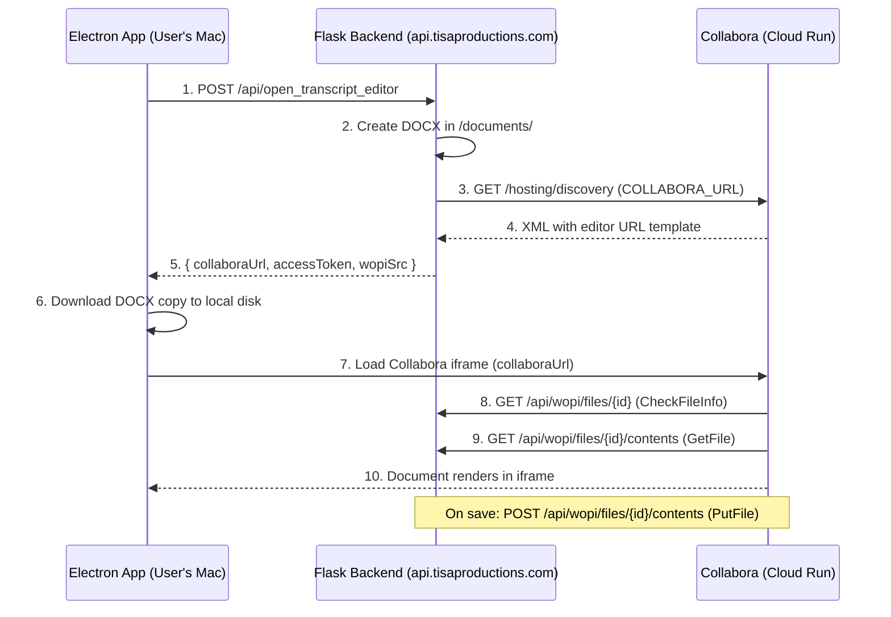

# Deploying Collabora Online on Google Cloud Run

Complete guide for hosting the custom Collabora Docker image (`ronitgandotra/collabora-ronit-version`) on Google Cloud Run and connecting it to the Flask backend.

---

## Architecture Overview



### Three Servers, Three Roles

| Server | Role | URL |
|--------|------|-----|
| **Flask Backend** | Creates documents, serves WOPI endpoints | `https://api.tisaproductions.com` |
| **Cloud Run Collabora** | Renders editor UI, processes edits | `https://collabora-ronit-version-140170437531.us-central1.run.app` |
| **Electron App** | User interface, downloads local copy | `localhost:3000` |

### How WOPI Works (Simple Explanation)

Collabora is like Google Docs — it's a web editor that runs on a server. But it doesn't store files itself. It uses the **WOPI protocol** to read/write files from a separate server:

1. **CheckFileInfo** — Collabora asks: "Tell me about this file" (name, size, permissions)
2. **GetFile** — Collabora asks: "Give me the actual file bytes"
3. User edits in the browser...
4. **PutFile** — Collabora says: "Here's the updated file, save it" (auto-saves ~every 30s)

The WOPI server (Flask backend) holds the file. Collabora calls **back** to the backend via HTTP. Both are public servers, so they can reach each other.

### Why Not a Local WOPI Server?

The original Electron setup used a **local WOPI server** (`localhost:9090`) paired with **local Docker Collabora** (`localhost:9980`). This worked because both were on the same machine.

With Cloud Run Collabora, the editor runs on Google's servers. It **cannot** reach `localhost:9090` on the user's Mac (behind NAT/firewall). So the Flask backend acts as the WOPI server instead — Cloud Run can reach `api.tisaproductions.com`.

---

## Environment Variables

### Backend `.env` (Production Server)

```bash
# Collabora Cloud Run URL — backend fetches discovery XML from here
export COLLABORA_URL="https://collabora-ronit-version-140170437531.us-central1.run.app"

# Backend's own public URL — Collabora calls back here for WOPI
export WOPI_HOST_URL="https://api.tisaproductions.com"
```

### How They're Used

| Variable | Direction | Purpose |
|----------|-----------|---------|
| `COLLABORA_URL` | Backend → Collabora | Fetch `/hosting/discovery` XML, build editor iframe URL |
| `WOPI_HOST_URL` | Collabora → Backend | WOPI callbacks: `{WOPI_HOST_URL}/api/wopi/files/{id}` |

### Cloud Run Environment Variables

| Variable | Value | Purpose |
|----------|-------|---------|
| `extra_params` | `--o:ssl.enable=false --o:ssl.termination=true --o:net.proto=IPv4 --o:security.seccomp=false --o:mount_jail_tree=false` | Runtime stability flags |
| `aliasgroup1` | `https://api.tisaproductions.com` | Allowed WOPI host (security) |

---

## Prerequisites

- Google Cloud account with billing enabled
- `gcloud` CLI installed and authenticated
- Docker image pushed to Docker Hub (`ronitgandotra/collabora-ronit-version:latest`)

```bash
# Install gcloud (if not already)
brew install google-cloud-sdk

# Login and set project
gcloud auth login
gcloud config set project vivid-env-425623-i6
```

---

## Step 1: Deploy Collabora to Cloud Run

### Via Cloud Shell (Recommended)

Open Cloud Shell in GCP Console (click `>_` icon top-right), then run:

```bash
gcloud config set project vivid-env-425623-i6

gcloud run deploy collabora-ronit-version \
  --image ronitgandotra/collabora-ronit-version:latest \
  --region us-central1 \
  --platform managed \
  --port 9980 \
  --memory 2Gi \
  --cpu 2 \
  --min-instances 1 \
  --max-instances 3 \
  --timeout 300 \
  --allow-unauthenticated \
  --set-env-vars "extra_params=--o:ssl.enable=false --o:ssl.termination=true --o:net.proto=IPv4 --o:security.seccomp=false --o:mount_jail_tree=false,aliasgroup1=https://api.tisaproductions.com"
```

### Via GCP Console UI

1. Go to **Cloud Run** → **Create Service**
2. Container image: `ronitgandotra/collabora-ronit-version:latest`
3. Region: `us-central1`
4. **Container port: `9980`** (NOT 8080 — Collabora listens on 9980, baked into the Dockerfile)
5. CPU: `2`, Memory: `2 GiB`
6. Min instances: `1` (avoids cold starts), Max: `3`
7. Authentication: **Allow unauthenticated invocations**
8. Variables & Secrets tab — add `extra_params` and `aliasgroup1` as above
9. Deploy

### Critical Settings

| Setting | Value | Why |
|---------|-------|-----|
| Port | **9980** | Built into Dockerfile (`EXPOSE 9980`). Using 8080 = health check fails |
| CPU/Memory | **2 vCPU / 2 GiB** | Minimum for Collabora stability. 512MiB/1CPU = crashes |
| Min instances | **1** | Collabora boot takes 30-60s. Cold starts unacceptable for editor |

### `extra_params` Flags Explained

| Flag | Why |
|------|-----|
| `--o:ssl.enable=false` | Cloud Run terminates TLS at load balancer |
| `--o:ssl.termination=true` | Tells Collabora to generate `https://` URLs |
| `--o:net.proto=IPv4` | Cloud Run uses IPv4 internally |
| `--o:security.seccomp=false` | **Critical.** Prevents startup crash on Cloud Run (seccomp not supported) |
| `--o:mount_jail_tree=false` | **Critical.** Avoids jail mount failures in cloud containers |

> [!CAUTION]
> Without `seccomp=false` and `mount_jail_tree=false`, the editor opens but shows a **black screen**. Container logs will show `notcoolmount: Operation not permitted`.

---

## Step 2: Make Service Publicly Accessible

If you get `403 Forbidden` on public requests, the service needs IAM policy:

```bash
gcloud run services add-iam-policy-binding collabora-ronit-version \
  --region=us-central1 \
  --member="allUsers" \
  --role="roles/run.invoker"
```

> [!NOTE]
> This command requires `run.services.setIamPolicy` permission. If you get `PERMISSION_DENIED`, ask the GCP project owner/admin to run it.

---

## Step 3: Verify Deployment

### Test Discovery (Public)

```bash
# From any terminal — no auth needed
curl -I https://collabora-ronit-version-140170437531.us-central1.run.app/hosting/discovery
```

Expected: `HTTP/2 200` with `content-type: text/xml`.

### Test Discovery (Authenticated — if public access isn't enabled yet)

```bash
# From Cloud Shell
curl -H "Authorization: Bearer $(gcloud auth print-identity-token)" \
  -I https://collabora-ronit-version-140170437531.us-central1.run.app/hosting/discovery
```

### Check Container Logs

```bash
gcloud run services logs read collabora-ronit-version --region us-central1 --limit 100
```

Look for: `Ready to accept connections on port 9980.`

### Live Tail Logs

```bash
gcloud run services logs tail collabora-ronit-version --region us-central1
```

---

## Step 4: Update Backend `.env`

SSH into the production server and edit the backend `.env`:

```bash
ssh tisa-backend
nano /opt/tisa/dev-test-sandbox/backend/.env
```

Add/update:

```diff
- export COLLABORA_URL="http://localhost:9980"
- export WOPI_HOST_URL="http://host.docker.internal:8000"
+ export COLLABORA_URL="https://collabora-ronit-version-140170437531.us-central1.run.app"
+ export WOPI_HOST_URL="https://api.tisaproductions.com"
```

Restart the backend:

```bash
sudo systemctl restart tisa-backend
```

---

## Step 5: Update Cloud Run Service (If Needed)

To change env vars, CPU, memory, or other settings:

```bash
gcloud run services update collabora-ronit-version \
  --region us-central1 \
  --port 9980 \
  --cpu 2 \
  --memory 2Gi \
  --timeout 300 \
  --min-instances 1 \
  --max-instances 3 \
  --update-env-vars "extra_params=--o:ssl.enable=false --o:ssl.termination=true --o:net.proto=IPv4 --o:security.seccomp=false --o:mount_jail_tree=false,aliasgroup1=https://api.tisaproductions.com"
```

Verify env vars saved:

```bash
gcloud run services describe collabora-ronit-version \
  --region us-central1 \
  --format="flattened(spec.template.spec.containers[0].env)"
```

---

## Frontend Code Flow (Electron)

The `CollaboraEditorPage.js` handles two modes:

### Cloud Run Mode (Primary — when remote editor-config succeeds)

1. Electron calls `GET /api/wopi/editor-config/{fileId}` on production backend
2. Backend fetches discovery from Cloud Run Collabora
3. Backend returns `{ collaboraUrl, wopiSrc, accessToken }` — `collaboraUrl` points to Cloud Run
4. Electron also downloads the docx to local disk (local backup, `cleanup=false`)
5. Collabora iframe loads from Cloud Run URL
6. Edits saved via WOPI PutFile to production backend

### Local WOPI Fallback (when remote fails — for offline/local dev)

1. Remote editor-config fails (no internet, backend down)
2. Electron downloads docx to local WOPI temp dir
3. Local WOPI server (`localhost:9090`) serves the file
4. Requires local Collabora Docker at `localhost:9980`

### Key Code (CollaboraEditorPage.js)

```javascript
// If remote config has a collaboraUrl, use Cloud Run Collabora directly
if (remoteConfig) {
    console.log('[CollaboraEditor] Using Cloud Run Collabora (remote config)');
    setConfig(remoteConfig);
    return; // Skip local WOPI editor-config
}
// Otherwise fall through to local WOPI editor-config
console.log('[CollaboraEditor] Remote config unavailable, using local WOPI');
```

---

## WOPI Route Prefix

All WOPI endpoints are registered under `/api/wopi` to work with nginx:

```python
# backend/app/__init__.py
app.register_blueprint(wopi_bp, url_prefix='/api/wopi')
```

Full WOPI endpoint paths:
- `GET /api/wopi/files/{fileId}` — CheckFileInfo
- `GET /api/wopi/files/{fileId}/contents` — GetFile
- `POST /api/wopi/files/{fileId}/contents` — PutFile
- `GET /api/wopi/editor-config/{fileId}` — Editor config
- `GET /api/wopi/fetch-document/{fileId}` — Electron file download

The `wopiSrc` built by the backend includes this prefix:
```python
wopi_src = f"{host_url}/api/wopi/files/{secure_filename(file_id)}"
# → https://api.tisaproductions.com/api/wopi/files/office-xxx.docx
```

---

## CSP Frame-Ancestors (Allowing Electron to Embed Collabora)

By default, Cloud Run Collabora only allows framing from the domains in `aliasgroup1`. If your Electron app runs at `http://localhost:3000`, the iframe will be **blocked** with:

```
Refused to frame '...' because an ancestor violates the Content Security Policy directive: 
"frame-ancestors collabora-ronit-version-...run.app:* api.tisaproductions.com:*"
```

**Fix:** Add `--o:net.frame_ancestors=http://localhost:3000` to `extra_params`:

```bash
gcloud run services update collabora-ronit-version \
  --region us-central1 \
  --update-env-vars "extra_params=--o:ssl.enable=false --o:ssl.termination=true --o:net.proto=IPv4 --o:security.seccomp=false --o:mount_jail_tree=false --o:net.frame_ancestors=http://localhost:3000,aliasgroup1=https://api.tisaproductions.com"
```

> [!NOTE]
> **You do NOT need to stop the previous running instance.** Cloud Run automatically creates a new revision and routes 100% of traffic to it. The old instance shuts down on its own. Every `gcloud run services update` is a zero-downtime rolling update.

For production (packaged Electron app), update the frame_ancestors to match the app's actual origin (e.g., `app://` or `file://`).

---

## Troubleshooting

### Black Screen in Editor

**Cause:** Missing `seccomp=false` or `mount_jail_tree=false` flags.

**Fix:**
```bash
gcloud run services update collabora-ronit-version \
  --region us-central1 \
  --update-env-vars "extra_params=--o:ssl.enable=false --o:ssl.termination=true --o:net.proto=IPv4 --o:security.seccomp=false --o:mount_jail_tree=false"
```

### 503 Service Unavailable from Backend

**Cause:** Backend can't reach Cloud Run Collabora (`/hosting/discovery` timeout).

**Debug:**
```bash
# From production server
curl -s -o /dev/null -w "%{http_code}" \
  https://collabora-ronit-version-140170437531.us-central1.run.app/hosting/discovery
```

**Possible causes:** Cold start (wait 30-60s), Cloud Run instance down, wrong `COLLABORA_URL`.

### 403 Forbidden on Discovery

**Cause:** Cloud Run requires authentication.

**Fix:** Enable public access (see Step 2).

### 404 on WOPI Callbacks

**Cause:** `wopiSrc` URL doesn't match Flask route prefix.

**Fix:** Ensure `wopi_bp` is registered at `/api/wopi` and `WOPI_HOST_URL` doesn't include `/api` suffix (the code adds it).

### PostMessage Origin Mismatch

**Cause:** Collabora iframe origin doesn't match the Electron app's origin.

**Fix:** Ensure the `origin` parameter in `editor-config` request matches `window.location.origin`. In dev mode this is `http://localhost:3000`.

---

## Cost Estimate

| Service | Config | Monthly Cost (approx.) |
|---------|--------|----------------------|
| Collabora (min=0) | 2 CPU, 2GB RAM | ~$5-20 (pay-per-use) |
| Collabora (min=1) | 2 CPU, 2GB RAM | ~$50-100 (always on) |
| Backend | Existing VM | Already running |

---

## File Storage Location

Documents are stored on the production backend at:

```
/opt/tisa/dev-test-sandbox/backend/app/documents/
```

Configured in `app/__init__.py`:
```python
app.config['DOCUMENTS_DIR'] = os.getenv(
    'WOPI_DOCUMENTS_DIR',
    os.path.join(os.path.dirname(__file__), 'documents')
)
```

Collabora reads/writes files here via WOPI. Electron downloads a local copy on editor open (`cleanup=false` so the server copy persists for Collabora).

---

## Quick Reference: Deployment Commands

```bash
# Set project
gcloud config set project vivid-env-425623-i6

# Deploy/update Collabora
gcloud run services update collabora-ronit-version \
  --region us-central1 \
  --port 9980 \
  --cpu 2 \
  --memory 2Gi \
  --timeout 300 \
  --min-instances 1 \
  --max-instances 3 \
  --update-env-vars "extra_params=--o:ssl.enable=false --o:ssl.termination=true --o:net.proto=IPv4 --o:security.seccomp=false --o:mount_jail_tree=false,aliasgroup1=https://api.tisaproductions.com"

# Make public
gcloud run services add-iam-policy-binding collabora-ronit-version \
  --region=us-central1 \
  --member="allUsers" \
  --role="roles/run.invoker"

# Verify
curl -I https://collabora-ronit-version-140170437531.us-central1.run.app/hosting/discovery

# Check logs
gcloud run services logs read collabora-ronit-version --region us-central1 --limit 100

# Describe service
gcloud run services describe collabora-ronit-version --region us-central1 \
  --format="flattened(spec.template.spec.containers[0].env)"
```
